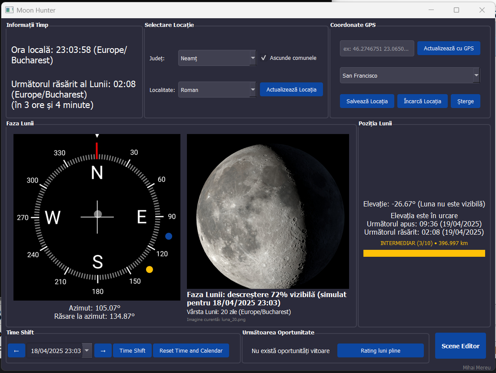

# Moon Hunter

Moon Hunter is a comprehensive lunar monitoring and planning application for photographers and astronomy enthusiasts. It provides detailed information about the moon's position, phase, and visibility, making it ideal for planning photography sessions.



## Features

### Moon Tracking
- Real-time tracking of the moon's position (elevation and azimuth)
- Detailed information about the moon's phase, illumination percentage, and age
- Visual representation of the moon's current phase
- Distance information with perigee/apogee indicators and ratings

### Compass Visualization
- Interactive compass showing the moon's current azimuth
- Indication of the next moonrise location
- Visual indicators for when the moon is visible or below the horizon

### Location Management
- Romania-specific location selection by county (județ) and locality
- GPS coordinate input for worldwide locations
- Location profile saving and management
- Automatic timezone detection based on coordinates

### Time Features
- Real-time updates of all lunar data
- Time shift functionality to simulate moon positions at different dates and times
- Visual distinction between past and future time shifts

### Photography Planning Tools
- Scene Editor for creating and managing photography scenarios
- Customizable parameters for target azimuth, elevation, time windows, and minimum illumination
- Automatic calculation of optimal shooting opportunities
- Rating system for full moons based on distance (perigee/apogee)

## Requirements

- Python 3.6+
- PyQt5
- Skyfield
- Requests
- Pandas
- PyTZ
- TimezoneFinder
- Win32API (for Windows single instance functionality)

## Installation

1. Clone the repository:
   ```
   git clone https://github.com/yourusername/moonhunter.git
   cd moonhunter
   ```

2. Install the required dependencies:
   ```
   pip install -r requirements.txt
   ```

3. Run the application:
   ```
   python moonhunter.py
   ```

## Usage

### Basic Navigation

1. **Location Selection**:
   - Choose a Romanian location using the county and locality dropdowns
   - Or input GPS coordinates manually
   - Or select a saved location profile

2. **Moon Information**:
   - View current position, phase, and visibility in the main window
   - The compass shows the moon's current azimuth and rise azimuth
   - Distance information shows how close the moon is to perigee or apogee

3. **Time Shifting**:
   - Use the Time Shift controls to simulate the moon's position at different times
   - The interface changes color to indicate if you're viewing past or future times

### Photography Planning

1. **Scene Editor**:
   - Click "Scene Editor" to open the planning interface
   - Create new scenes with specific azimuth, elevation, time, and illumination criteria
   - View calculated opportunities for each scene

2. **Upcoming Opportunities**:
   - The "Next Opportunity" section shows the upcoming shooting opportunities
   - Full moon ratings help identify the best full moons to photograph

## Configuration Files

The application manages several configuration files:
- `moon_settings.json`: General application settings and profiles
- `moon_scenes.json`: Saved photography scenes and opportunities
- `lista_localitati_cu_statii.xlsx` / `.csv`: Romanian locality database with coordinates

## Credits

- Developed by Mihai Mereu
- Moon phase images are located in the `poze_cer` folder
- Compass image should be located in the application directory

## License

[Specify your license information here]
